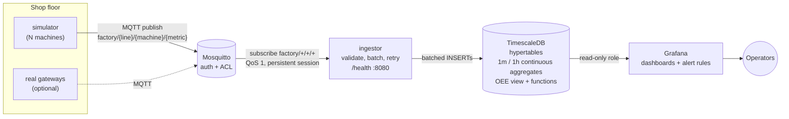

# IoT Factory Monitor

Manufacturing IoT pipeline: MQTT to time-series database to live dashboard.

[](LICENSE)
[](https://github.com/calliarc/iot-factory-monitor/actions/workflows/ci.yml)


> **Status:** v0.1.0, the first working release. The data model, topic scheme and dashboards may still change before 1.0.

## Features

- Sensor simulator for temperature, vibration and machine status. It also sends spindle speed and good/scrap part counts for any number of machines, with wear drift and random faults.
- MQTT ingestion into TimescaleDB. Messages are validated with pydantic, batched, and written into hypertables. The service reconnects with backoff and has a health endpoint.
- Prebuilt Grafana dashboards for OEE, downtime and sensor trends
- Threshold-based alerts for temperature, vibration, machines down too long, and machines that stop reporting (Grafana unified alerting)
- Whole stack starts with one command (`make up`)

## Tech stack

- MQTT (Eclipse Mosquitto 2.0, username/password auth plus ACL)
- Python ingestion service (Python 3.10+, paho-mqtt 2, pydantic 2, psycopg 3)
- TimescaleDB 2.17 on PostgreSQL 16 (hypertables, compression, continuous aggregates, retention)
- Grafana 11 (provisioned datasource, dashboards and alert rules)
- Docker Compose

## Getting started

Requirements: Docker with the Compose v2 plugin, and `make`. Python 3.10+ is only needed to run the tests.

```bash
git clone https://github.com/calliarc/iot-factory-monitor.git
cd iot-factory-monitor
make up          # copies .env.example to .env on first run, builds and starts everything
```

Then open **http://localhost:3000** and log in with `GRAFANA_ADMIN_USER` / `GRAFANA_ADMIN_PASSWORD` from `.env`. The home dashboard is **Factory overview**. Data shows up within a few seconds. The hourly OEE trend fills in as the hours go by.

| Command | What it does |
|---|---|
| `make up` | Build and start the stack in the background |
| `make down` | Stop the stack (data volumes are kept) |
| `make logs` | Follow the logs of all services (`make logs S=ingestor` for one) |
| `make ps` | Service status |
| `make test` | Run the unit tests (offline, no Docker needed) |
| `make smoke` | End-to-end check against a running stack |
| `make psql` | Open `psql` in the database |
| `make clean` | Stop the stack **and delete all data** |

Ingestor health: `curl localhost:8080/health` returns JSON. The status code is 200 when MQTT and the database are both connected, 503 otherwise.

> **Change the passwords.** `.env.example` holds development defaults only, all marked `change-me`. All ports bind to `127.0.0.1`. Before you expose the stack, set strong passwords and add TLS to MQTT (a `listener 8883` with `cafile`/`certfile`/`keyfile` in `mosquitto/mosquitto.conf`) and to Grafana. Anonymous MQTT is disabled. Give each real gateway its own MQTT user in `mosquitto/acl`.

### Running the tests

```bash
python3 -m venv .venv && . .venv/bin/activate
pip install -r requirements-dev.txt
python -m pytest
```

The tests cover topic and payload validation, the OEE and threshold functions, batching and backoff, and the simulator model. They also check that simulator output passes ingestor validation, that the Grafana provisioning is consistent (alert thresholds match `thresholds.py`), and that `db/init.sql` parses with the real PostgreSQL parser (pglast).

## Architecture



| Path | Contents |
|---|---|
| `simulator/` | Machine model (`machine.py`, pure and seedable) and MQTT publisher |
| `ingestor/` | Validation (`models.py`), OEE (`oee.py`), thresholds (`thresholds.py`), batching/backoff (`batching.py`), DB writer, health server |
| `db/init.sql` | Schema, hypertables, compression, continuous aggregates, retention, OEE |
| `mosquitto/` | Broker config, ACL, and an entrypoint that hashes passwords from `.env` |
| `grafana/` | Provisioned datasource, dashboards (`grafana/dashboards/*.json`) and alert rules |
| `scripts/smoke_test.sh` | End-to-end check used by CI |

## Topic and payload schema

Topic: `factory/{line}/{machine}/{metric}`. `line` and `machine` are lowercase identifiers (`[a-z0-9][a-z0-9_-]*`), for example `factory/line-1/cnc-02/vibration`.

Every payload is a JSON object. `ts` is an ISO-8601 timestamp with a timezone offset. Unknown extra fields are ignored.

| metric | payload | notes |
|---|---|---|
| `temperature` | `{"ts": "2026-01-01T12:00:00Z", "value": 64.2, "unit": "C"}` | -50 to 400 C |
| `vibration` | `{"ts": "...", "value": 2.84, "unit": "mm/s"}` | RMS velocity, 0 to 200 mm/s |
| `spindle_speed` | `{"ts": "...", "value": 11950.0, "unit": "rpm"}` | 0 to 60000 rpm |
| `status` | `{"ts": "...", "status": "RUNNING", "interval_s": 1.0}` | `RUNNING` \| `IDLE` \| `DOWN`. Heartbeat meaning "was in this state for the last `interval_s` seconds" (default 1.0) |
| `parts` | `{"ts": "...", "good": 1, "scrap": 0}` | Parts completed since the previous message (increments, not totals) |

`unit` is optional, but if present it must match. The ingestor rejects and counts invalid messages: bad topics, bad JSON, wrong types, implausible values, timestamps more than 5 minutes in the future. It logs these at a rate limit, and they show as `messages_invalid` in `/health`.

## OEE definition

OEE (Overall Equipment Effectiveness) = **Availability × Performance × Quality**. Each factor is computed per machine over a time window:

| Factor | Formula | Loss it captures |
|---|---|---|
| Availability | RUNNING time / (RUNNING + IDLE + DOWN time) | Stops. IDLE (starved or blocked) and DOWN (faults) both count as losses, because the simulator assumes a 24/7 schedule where all observed time is planned |
| Performance | (ideal cycle time × total parts) / RUNNING time, capped at 1 | Running slower than the design rate |
| Quality | good parts / (good + scrap) | Scrap |

The ideal cycle time comes from `machines.ideal_cycle_time_s`. Rows are added automatically the first time a machine reports, with a default of 2.0 s. Set it to each machine's real value:

```sql
UPDATE machines SET ideal_cycle_time_s = 1.6 WHERE line = 'line-1' AND machine = 'cnc-02';
```

A factor is NULL when it is undefined (no time, no run time, or no parts). OEE is then NULL too. The SQL (`oee_availability`/`oee_performance`/`oee_quality`, the `machine_oee_hourly` view and `oee_window(from, to)`) and the Python reference implementation (`ingestor/ingestor/oee.py`, unit-tested) use the same formulas. The plant-level figure on the dashboard adds up time and parts across machines, weighting performance by run time. A common benchmark for world-class OEE is 85%.

## Data retention

| Data | Kept for |
|---|---|
| Raw sensor readings | 7 days (compressed after 1 day) |
| Raw status and part counts | 30 days (compressed after 2 days) |
| 1-minute aggregates | 90 days |
| 1-hour aggregates (and hourly OEE) | 2 years |

The continuous aggregates use real-time aggregation, so the latest minute and hour are always included. The retention policies and `init.sql` only take effect when the database volume is first created. Use `make clean` to start over.

## Alerts

These are provisioned in the Grafana folder **Factory** (`grafana/provisioning/alerting/alert-rules.yml`):

| Rule | Condition |
|---|---|
| Temperature warning / critical | 5-min average > 75 C (for 2 min) / > 85 C (for 1 min) |
| Vibration warning / critical | 5-min average RMS > 4.5 mm/s / > 7.1 mm/s (ISO 10816-3 zone C / D) |
| Machine down | DOWN for more than 5 minutes |
| Machine not reporting | No telemetry for more than 2 minutes |

The same limits are in `ingestor/ingestor/thresholds.py`, and a test keeps the two in sync. The ingestor also logs threshold transitions. Alerts go to Grafana's default notification policy. Add a contact point (email, Slack, Teams, webhook) to get notified.

## Configuration

All settings are in `.env` (see `.env.example`). The main ones:

| Variable | Default | Meaning |
|---|---|---|
| `SIM_LINES`, `SIM_MACHINES_PER_LINE` | 2, 3 | Number of simulated machines |
| `PUBLISH_INTERVAL_S` | 1.0 | Simulator tick |
| `SIM_FAULT_RATE` | 1.0 | Fault frequency multiplier (1.0 is about one fault per machine every 25 min) |
| `SIM_SEED` | empty | Integer for reproducible runs |
| `BATCH_SIZE`, `FLUSH_INTERVAL_S` | 500, 1.0 | Ingestor batch size and maximum flush delay |
| `MAX_BUFFER` | 100000 | Records kept in memory while the DB is down (oldest are dropped beyond this) |

To connect real machines, publish the schema above to the broker as a user with write access in `mosquitto/acl`, and stop the simulator (`docker compose stop simulator`).

## Verification status

This is what was verified when v0.1.0 was built:

- All unit tests pass on Python 3.10. `db/init.sql` and the SQL function bodies parse with the PostgreSQL parser. `docker-compose.yml` validates against the Compose JSON schema. The Grafana provisioning files are valid YAML/JSON and cross-checked by tests.
- The simulator and ingestor were run together against a local MQTT broker. Messages flowed and validated. With the database unavailable, the ingestor buffered, retried with backoff, and reported 503 on `/health`.
- **Not run in the build environment:** the full Docker stack. Docker was not available there, so the TimescaleDB-specific DDL, Mosquitto auth, Grafana provisioning and dashboard queries were not run against the real services. The CI workflow (`.github/workflows/ci.yml`) runs `docker compose config`, starts the stack, and runs `scripts/smoke_test.sh` to check all of this end to end. Please open an issue if anything fails on your setup.

## Roadmap

- [x] Initial release
- [x] Documentation and examples
- [x] CI and automated tests
- [ ] MQTT TLS profile and per-gateway credentials tooling
- [ ] Shift calendars (planned downtime excluded from availability)
- [ ] Sparkplug B / OPC UA input adapters

Have an idea? [Open an issue](https://github.com/calliarc/iot-factory-monitor/issues).

## Contributing

Contributions are welcome. See [CONTRIBUTING.md](CONTRIBUTING.md).

## License

[MIT](LICENSE) © 2026 CalliArc

---

Built and maintained by [CalliArc](https://www.calliarc.com/). Need help with manufacturing technology? [Talk to our team](https://www.calliarc.com/industries/manufacturing/).
